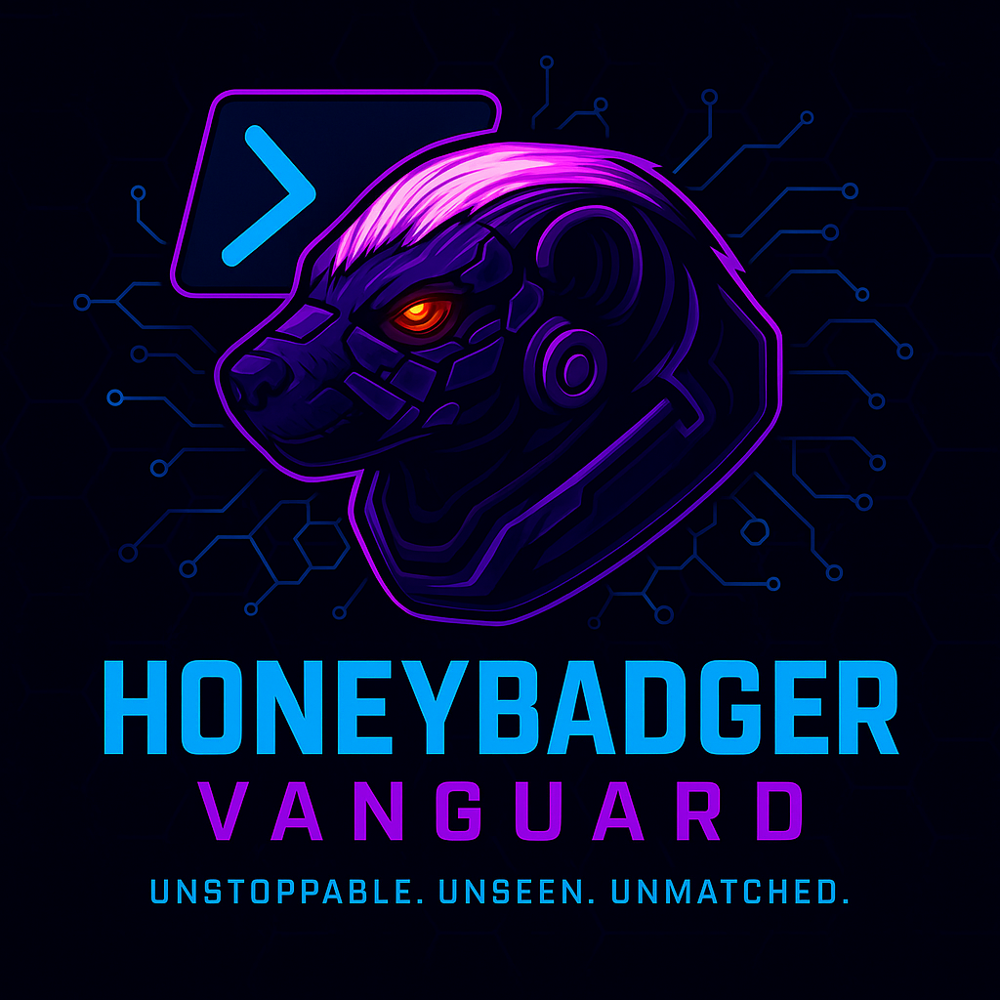

<div align="center">



# HoneyBadger Vanguard 3.0™ (iHBV™)

### AI-Powered Active Defense for CyberShield 2026

**UNSTOPPABLE. UNSEEN. UNMATCHED.**

[](https://ihbv.io)
[](https://github.com/invokehoneybadger)
[](LICENSE)

</div>

---

## 🦡 About

HoneyBadger Vanguard 3.0™ (iHBV™) is an **AI-powered active defense platform** designed to demonstrate cutting-edge offensive security capabilities at **CyberShield 2026** in Little Rock, Arkansas. Built on PowerShell-native automation, autonomous drone response, and real-time threat detection, iHBV™ represents the next evolution in proactive cybersecurity.

**Zero tolerance for threats. Zero compromise on capability.**

---

## ⚡ Core Capabilities

### 🛡️ Autonomous Threat Detection
- Real-time OSINT reconnaissance via **Damocles Phone Intelligence**
- **React2Shell** vulnerability detection with MITRE ATT&CK mapping
- AI-driven threat intelligence and correlation
- VirusTotal integration for payload analysis
- Professional HTML reporting with executive dashboards

### 🚁 Autonomous Drone Response
- M5Stack Fly autonomous aerial surveillance
- Byzantine fault-tolerant mesh networking
- GPS-guided waypoint navigation
- Real-time threat response coordination
- Swarm intelligence for distributed operations

### 📡 RF Threat Triangulation
- ESP32-based perimeter sensor network
- TDOA (Time Difference of Arrival) triangulation
- **Sub-meter accuracy** threat detection
- HomeRSSI wireless monitoring integration
- Multi-sensor fusion for enhanced precision

### 🚙 Vehicle Integration (KITT Mode)
- Jeep Wrangler 2022 platform integration
- OBD2/CAN bus telemetry monitoring
- Voice-activated security operations (Sheldon TTS)
- Real-time threat proximity alerts
- Mobile command & control center

### ⚡ PowerShell-Native Arsenal
- **40+ enterprise-grade PowerShell modules**
- ACAS vulnerability management automation
- **NullViper** payload generation with EDR evasion
- **Hans & Gret** skip tracing and OSINT tools
- PowerShell 7.5.4 optimized for modern Windows

### 🎯 Red Team Automation
- Multi-agent AI orchestration framework
- Campaign audit logging with chain-of-custody
- OPSEC continuous monitoring via **CodeZen**
- Active Directory enumeration
- Lateral movement automation

---

## 🏗️ Architecture
```
┌─────────────────────────────────────────────────────────────┐
│                    iHBV™ Control Layer                       │
│                  (AI Decision Engine)                        │
└─────────────────────────────────────────────────────────────┘
           │              │              │              │
           ▼              ▼              ▼              ▼
    ┌──────────┐   ┌──────────┐   ┌──────────┐   ┌──────────┐
    │  OSINT   │   │  Drone   │   │    RF    │   │ Vehicle  │
    │  Module  │   │  Swarm   │   │ Sensors  │   │  Platform│
    └──────────┘   └──────────┘   └──────────┘   └──────────┘
         │              │              │              │
         └──────────────┴──────────────┴──────────────┘
                           │
                           ▼
                  ┌──────────────────┐
                  │  PowerShell 7.5  │
                  │  Execution Core  │
                  └──────────────────┘
```

---

## 🔧 Tech Stack

**Languages & Frameworks:**
- PowerShell 7.5.4 (Primary)
- Python 3.11+ (AI/ML components)
- C/C++ (ESP32 firmware)
- JavaScript/HTML/CSS (Web UI)

**AI/ML:**
- Claude Sonnet 4.5 (Multi-agent orchestration)
- Coqui TTS (Sheldon voice synthesis)
- Dual Tesla P40 GPUs (384GB RAM training cluster)
- Dell PowerEdge R720 inference server

**Hardware:**
- M5Stack Fly drones
- ESP32-C3/S3 RF sensor arrays
- Raspberry Pi 5 cluster (Hailo AI accelerators)
- OrangePi 6P (vehicle integration)
- Jeep Wrangler 2022 (mobile platform)

**Networking:**
- Byzantine fault-tolerant mesh
- TDOA triangulation (sub-meter accuracy)
- LoRa long-range communications
- CAN bus integration

---

## 🚀 Quick Start

### Prerequisites
```powershell
# PowerShell 7.5.4+
winget install Microsoft.PowerShell

# Git
winget install Git.Git

# Python 3.11+
winget install Python.Python.3.11
```

### Clone & Setup
```powershell
# Clone the repository
git clone https://github.com/invokehoneybadger/ihbv.io.git
cd ihbv.io

# Install dependencies (placeholder - actual modules in private repos)
# .\Setup-iHBV.ps1
```

### Configuration
```powershell
# Configure API keys and endpoints
# Copy-Item config.example.json config.json
# Edit config.json with your settings
```

---

## 📋 CyberShield 2026 Demonstrations

### Live Demos:
1. **Autonomous Threat Response** - Full kill chain from detection to drone deployment
2. **RF Triangulation** - Real-time signal source location with sub-meter precision
3. **Vehicle Integration** - Voice-activated security operations from mobile platform
4. **PowerShell Arsenal** - Live red team automation and EDR evasion
5. **Multi-Agent AI** - Coordinated attack surface management

### Booth Information:
- **Conference Dates:** TBD 2026
- **Location:** Little Rock Convention Center, Arkansas
- **Contact:** honeybadger@ihbv.io

---

## 🎯 Project Status

- ✅ **Core Framework:** Complete
- ✅ **Drone Integration:** Operational
- ✅ **RF Triangulation:** Deployed
- ✅ **Vehicle Platform:** Testing
- 🚧 **Multi-Agent Orchestration:** In Development
- 🚧 **Production Hardening:** Q1 2026

---

## 🤝 Contributing

HoneyBadger Vanguard 3.0™ is primarily a research and demonstration platform. While the core codebase is private for OPSEC reasons, we welcome:

- Bug reports and vulnerability disclosures
- Feature suggestions for CyberShield demos
- Collaboration proposals
- Research partnerships

**Contact:** honeybadger@ihbv.io

---

## 📜 License

MIT License - See [LICENSE](LICENSE) for details.

**Educational and Research Use Only.** This platform is designed for authorized security research, penetration testing, and educational demonstrations. Users are responsible for ensuring compliance with all applicable laws and regulations.

---

## 🔗 Links

- **Website:** [ihbv.io](https://ihbv.io)
- **Main Site:** [invokehoneybadger.com](https://invokehoneybadger.com)
- **Pi Cluster:** [honeypi.io](https://honeypi.io)
- **GitHub:** [@invokehoneybadger](https://github.com/invokehoneybadger)
- **Email:** honeybadger@ihbv.io

---

## 🏆 Recognition

Built for **CyberShield 2026** - Little Rock, Arkansas

*"Effective defenders must understand offensive techniques. HoneyBadger doesn't just understand them - we automate them."*

---

<div align="center">

### 🦡 UNSTOPPABLE. UNSEEN. UNMATCHED. 🦡

**© 2026 HoneyBadger Vanguard, LLC. All Rights Reserved.**

*iHBV™ and HoneyBadger Vanguard™ are trademarks of HoneyBadger Vanguard, LLC.*

</div>
